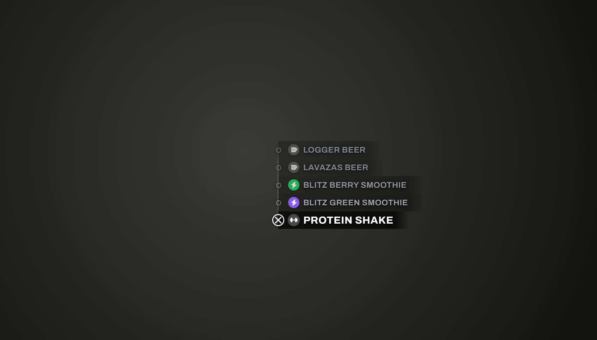

# ox_target_redesign

A GTA VI styled UI for [ox_target](https://github.com/communityox/ox_target).



Drop-in replacement for the `web` folder only. No Lua is touched, no exports change,
no config is added — every existing target option keeps working exactly as before.

## What changes

- Vertical rail with a node per option, crosshair marker on the selected one
- Selected option is pure white and larger, the rest fade with distance
- Circular icon badges, tinted by the option's `iconColor` when it is set
- Mouse hover, mouse wheel, arrow keys and `Enter` all move/confirm the selection
- Staggered entry animation, dense layout when an entity has many options

## Install

1. Download this repository.
2. Replace `ox_target/web` with the `web` folder from here.
3. `restart ox_target`

Keep a copy of the original `web` folder, or pull it back from the
[ox_target repository](https://github.com/communityox/ox_target) to revert.

## Tuning

Sizes and colors live in the `:root` block of `web/style.css`:

```css
--row-height: 25pt;   /* vertical spacing between options */
--node-size: 21pt;    /* rail marker size */
--font-active: 14.5pt;
--font-idle: 11.5pt;
```

The dense preset under `#options-wrapper.is-dense` kicks in above 13 visible options.

## Requirements

- ox_target 1.18.0 or newer
- Internet access in NUI for the Archivo font and Font Awesome, both loaded from a CDN
  (stock ox_target already loads Font Awesome the same way)

## License

MIT. Based on ox_target by Overextended — see [LICENSE](LICENSE).
